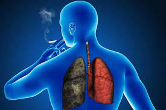
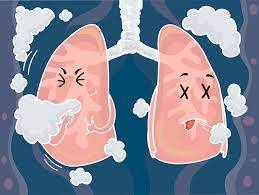
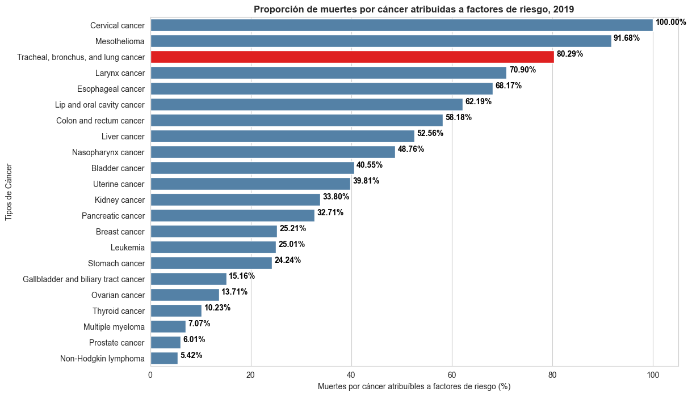
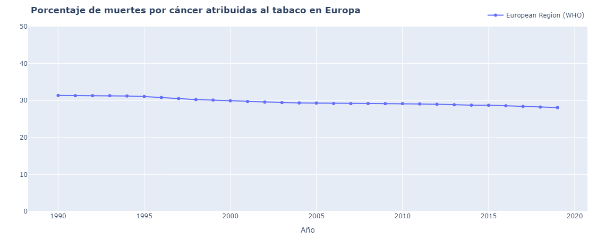
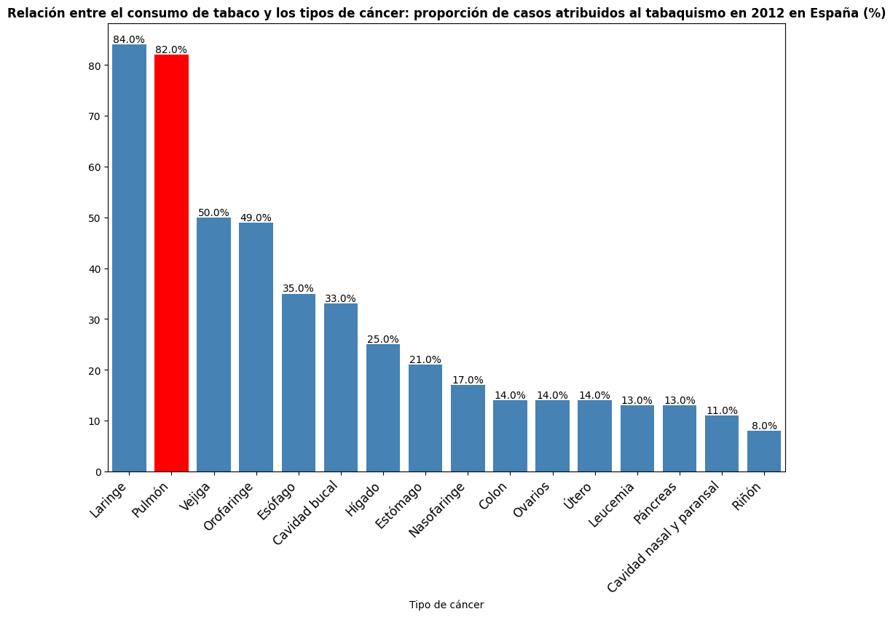
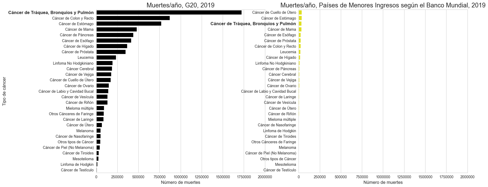
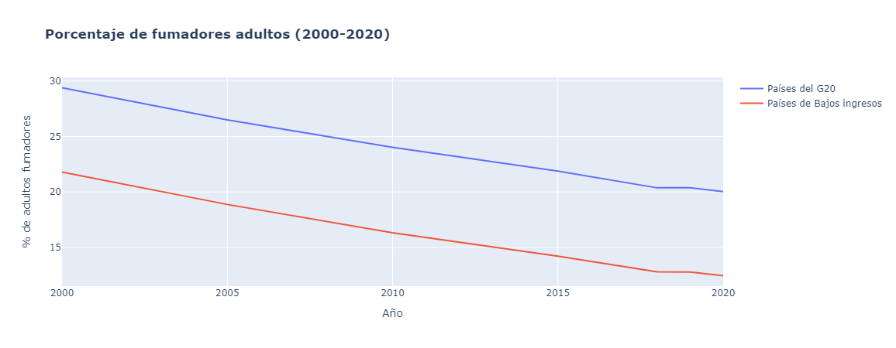
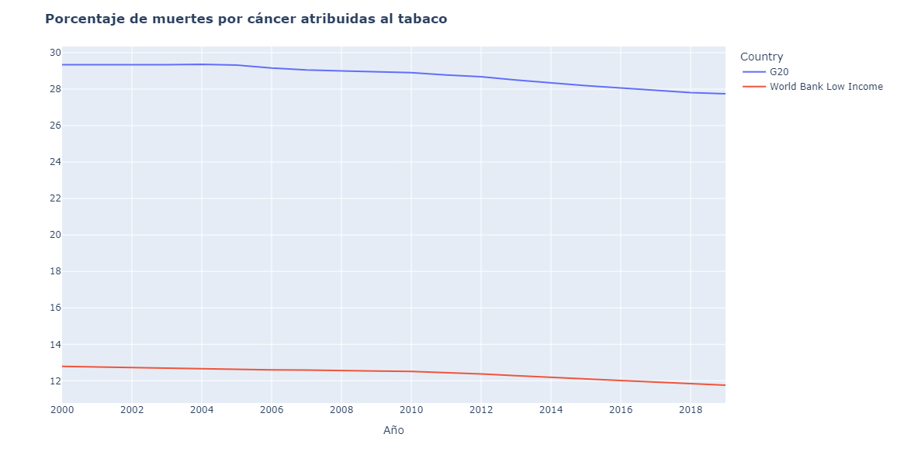
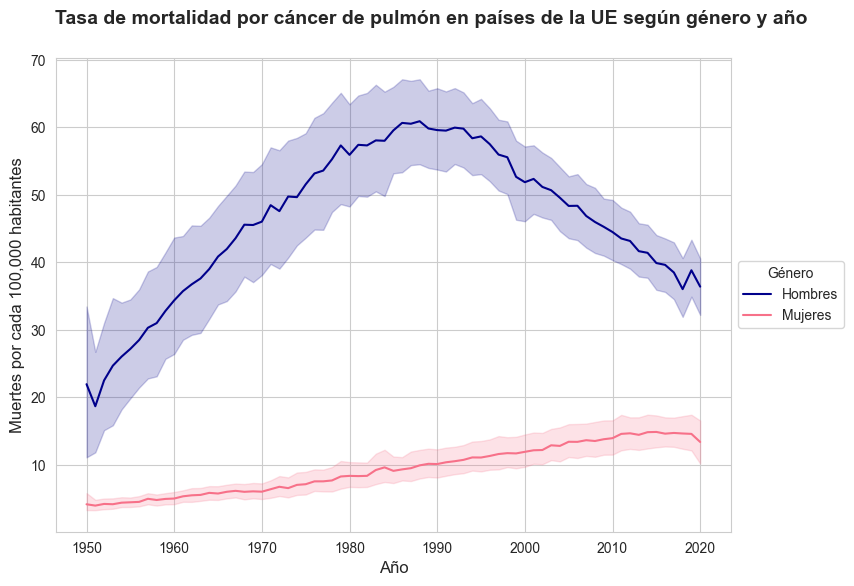

# ANÁLISIS EXPLORATORIO DEL CÁNCER DE PULMÓN

## INTRODUCCIÓN
La epidemia del cáncer de pulmón es un tema de gran relevancia en la salud pública a nivel mundial ya que afecta a millones de personas en todo el mundo. El consumo de tabaco es considerado el principal factor de riesgo para desarrollar esta enfermedad.

💭 **"El hombre es libre, pero en todas partes está encadenado" -​ Jean-Jacques Rousseau​**

**PRIMER OBJETIVO: Demostrar y medir la importancia que el tabaco representa en el diagnóstico y en las muertes por cáncer de pulmón, teniendo la genética un papel secundario**.

Es bien sabido que el tabaco y el cáncer de pulmón van de la mano.

Pero, ¿hasta qué punto?,¿qué papel juega la genética en todo esto?

Primero, demostramos que la genética es responsable de menos del 20% de las muertes por cáncer de pulmón en el mundo.

Demostramos también que el 28,08% de muertes por cáncer fueron atribuidas al tabaco en **Europa**.

Resultado: 1 de cada 4 muertes por cáncer se atribuye al tabaquismo.

Por último, vamos a mostrar datos para **España**:
De los riesgos identificados, ¿cuántos casos de cáncer de pulmón se pueden atribuir al consumo de tabaco?​

El 82% de casos de cáncer de pulmón en España eran atribuidos al tabaco.

_Confirmamos nuestra hipótesis: La genética juega un papel secundario en los casos diagnosticados y muertes por cáncer de pulmón._

**SEGUNDO OBJETIVO: Demostrar que en los países de mayores ingresos existen más muertes por cáncer de pulmón.**

Sabiendo con exactitud el papel que el tabaco juega en este tipo de cáncer en concreto, vamos a ver que el cáncer de pulmón no está presente por igual ni por países ni por género.

Para demostrarlo, hacemos una comparativa de las muertes por cáncer de pulmón en los siguientes grupos de países:

* **G20**: 
  - Alto Índice de Desarrollo Humano (IDH).
  - Representan aprox. el 80% del PIB mundial.

* **Países de ingresos bajos del BM**:
  - Bajo Índice de Desarrollo Económico (IDH)
  - Ingresos per cápita bajos.

En este gráfico mostramos las muertes (en términos absolutos) por diferentes tipos de cáncer en estos dos grupos de países.

En valores relativos:

**TASA DE MORTALIDAD POR CÁNCER DE PULMÓN/100.000 HABITANTES**

**G20**: 
* 36 MUERTES/100.000 HABITANTES

**Países de ingresos bajos del BM**:
* 4 MUERTES/100.000 HABITANTES
  

¿POR QUÉ?

1. Vemos el % de fumadores existente para cada grupo de países.
  

  * __G20__: **20,02%** de fumadores en 2020
  * __Países de bajos ingresos__: **12,45%** de fumadores en 2020

2. Vemos el % de muertes por cáncer atribuidas al tabaco.
   

En los gráficos anteriores se puede apreciar una disminución en el porcentaje de fumadores y de muertes atribuidas al tabaco en ambos grupos de países. No obstante, la disminución no ocurre al mismo ritmo, ya que el porcentaje de fumadores disminuye a un ritmo mayor que el de las muertes.

**¿Posible explicación?**

Aunque una persona haya dejado de fumar, el daño pulmonar previo no se revierte lo suficientemente rápido, lo que resulta en una disminución más lenta de las muertes relacionadas con el tabaco en comparación con la disminución de la tasa de fumadores.

**"Aunque dejar de fumar reporta muchos beneficios y repone la salud pulmonar, existen cosas que no pueden volver a ser como antes. Algunos daños son irreversibles."** - Dr. Norman H. Edelman - Asesor científico de la Asociación Americana del Pulmón.

_Confirmamos nuestra hipótesis: En países económicamente más desarrollados hay una mayor incidencia de muertes por cáncer de pulmón porque la tasa de tabaquismo es mayor._ 💰 🚬 💊

**TERCER OBJETIVO: El cáncer de pulmón ha sido históricamente masculino pero en los últimos años se ha ido feminizando cada vez más, habiendo una tendencia diferente y con peor pronóstico para las mujeres.**

Este gráfico representa las muertes por cáncer de pulmón para los países de la Unión Europea, haciendo una distinción por género.

Con los datos para cada país de la UE, hemos obtenido la media de muertes para mujeres y hombres, y podemos observar que ambos siguen una tendencia diferente:

* El cáncer ha sido históricamente masculino.
* La tasa de mortalidad MASCULINA por cáncer de pulmón  ha disminuido desde 1990.